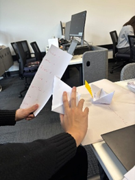
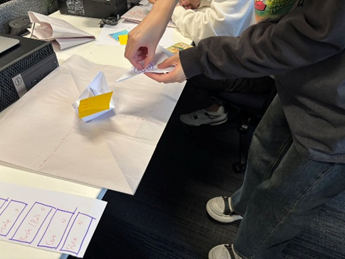
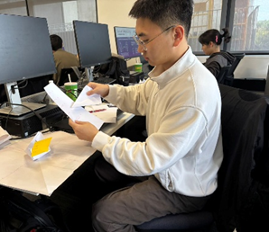
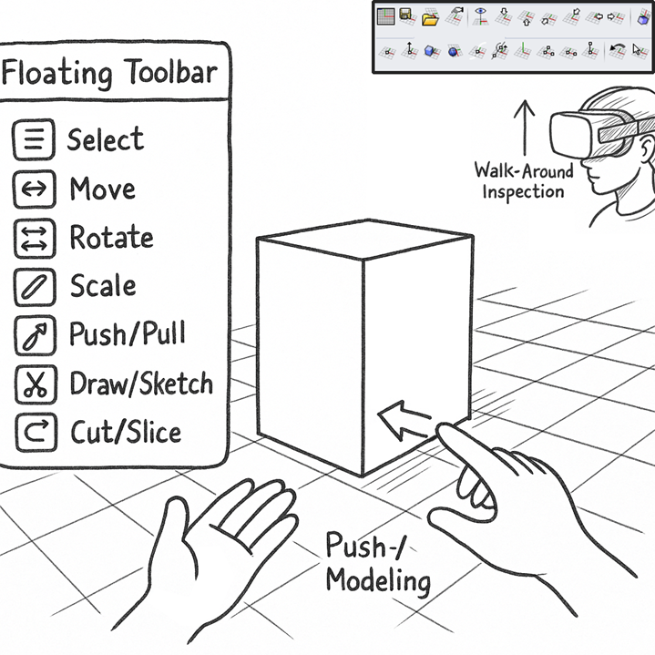

# Assessment 1.1 – DESIGN REPORT: Concept

Statement of Originality
This report contains my own original work, except where I have clearly indicated the use of external material.
All external images, code, and design elements have been appropriately cited, and adaptations have been clearly acknowledged.
I understand the University of Queensland’s policies on academic integrity and confirm that this submission complies with those requirements.
1. Application Selection
Category: XR Modeling (Creation & Editing)
Reason for Selection: Rhino is a commonly used 3D modeling tool in fields such as architecture, industrial design, and product design. However, it currently relies primarily on a mouse, keyboard, and 2D screen, lacking a direct sense of spatial manipulation. I wanted to design a 3D modeling software based on Rhino and transform it into an XR environment, allowing users to intuitively perform 3D modeling through gestures and body movements, enhancing immersion and operational efficiency.
2. User Tasks & Goals
User Task	Goal
Create and modify 3D geometry (e.g., extrude, scale, rotate objects)	Quickly build accurate 3D forms in a spatial environment
Navigate and inspect the model from multiple viewpoints	Identify design issues and assess proportions at real-world scale
Use the toolbar to perform modeling operations	Efficiently access common modeling functions
3. Concept Iteration Process
Initial Idea:
Floating toolbar placed on the user's dominant hand
Direct modeling with push-pull gestures
Week 2 Studio Paper Prototype Testing:
Model Block: Paper boat representing the model
Grid: Gridded paper serving as the plane
Flying: Up/Down sticky notes on hands simulating buttonsZoom and snap to the grid with both hands       
Key Feedback and Adjustments:
Adding a rotation button to the watch face; when the model is large, rotating it is more precise and convenient for viewing different perspectives than dragging or moving it manually
Fixed toolbar on the right side for better stability than floating tracking
   
4. XR Concept Definition
Target Platform: VR (MetaQuest 3) + Gesture Recognition, Support for Mixed Reality Mode (Desktop-Scale Modeling)
Core Functionality:
Floating Toolbar: Fixed to the dominant hand, includes functions such as selection, movement, rotation, and scaling
Push-Pull Modeling: Use both hands to directly stretch the surface of an object to create geometric shapes
Multi-View Navigation: Walk-around, orbit, and free flight
Multi-Scale Working Mode: Switch between desktop and full-scale immersive scales, with multiple viewpoints
AI Voice Commands: Quickly switch between tools and functions, and integrate with an AI voice assistant
 
5. Preliminary Test Plan
Test Content:
Impact of Toolbar Position on Operational Efficiency
Flight Mode Comfort and Control Accuracy
Hypothesis:
Users intuitively understand push-pull modeling
The fixed toolbar position does not obstruct vision
Free flight does not cause motion sickness
Data Collection Method:
Observe whether users can complete tasks without prompts
Record task completion time and number of incorrect operations
Questionnaire to assess interaction comfort and satisfaction
