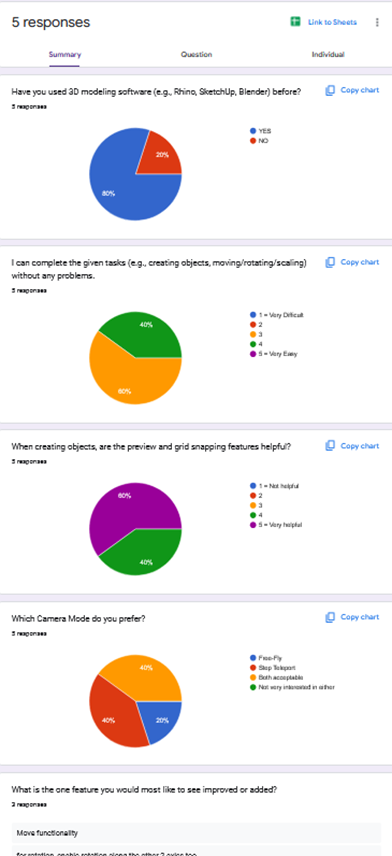

# Design Evaluation Report

1. Introduction
This project explores an XR 3D modeling prototype inspired by Rhino/CAD tools. Users can move around the scene with Free-Fly or Step Teleport camera modes, and use a floating toolbar to create (Create), select (Select), move (Move), rotate (Rotate), scale (Scale), and delete (Delete) objects. The aim of this evaluation is to test the usability of these functions and identify areas for iteration.
________________________________________
2. Objectives and Validation Metrics
The objectives of this evaluation were:
•	To test whether participants can intuitively understand and perform Create tasks.
•	To validate if participants can successfully complete Move, Rotate, Scale, and Delete operations.
•	To compare user comfort and preference between Free-Fly and Step Teleport camera modes.
Validation metrics included:
At least 80% of participants should complete a Create-and-stack task in under 1 minute.
Participants should be able to rotate and move objects without extended confusion (>30% hesitation rate considered problematic).
More than half of participants should clearly articulate a preference between camera modes.
________________________________________
3. Methodology
Participants: 5 student
Tasks:
Create multiple objects, stack them, resize with the scroll wheel.
Scale a cube, rotate it, move it to another location, and delete it.
Methods:
Task-based testing
Think-aloud protocol
Post-test survey
Data Collected: Task completion, observed behaviors, survey responses, peer comments.
________________________________________
4. Results
Observations
•	All participants completed tasks.
•	Create: Perceived as intuitive, stacking and resizing worked well.
•	Move: Required multiple clicks, participants expected drag-and-drop.
•	Rotate: Limited to Y-axis only, felt restrictive.
•	Scale: Intuitive with scroll wheel.
•	Delete: Functioned correctly, but not obvious at first.
•	Camera: Free-Fly felt natural, Step Teleport was more comfortable for long sessions.
Survey Results
Most found Grid Snapping and preview useful.
Scale was considered very intuitive, Move and Rotate less so.
General satisfaction: positive, prototype seen as “cool” and fun.
Peer Feedback Highlights
“Move feels unnatural, I want to drag objects directly.”
“Rotate should allow multiple axes.”
“Can we change object color or material?”
“UI text color contrast needs improvement.________________________________________
5. Analysis and Insights
Strengths: Create functionality is intuitive and enjoyable; Grid snapping helps precision; Delete mode prevents accidental removals.
Weaknesses: Move interaction inconsistent with user expectation; Rotate restricted; UI lacks clarity and tooltips; Camera modes split opinion.
Insight: Users prioritize interaction intuitiveness over feature count.
________________________________________
6. Evaluation of Aims
Create: Achieved – users could complete tasks quickly and intuitively.
Move/Rotate: Not fully achieved – tasks completed but with hesitation and complaints.
Camera: Partially achieved – preferences split, requiring clearer guidance.
Delete: Partially achieved – worked, but discoverability was low.
________________________________________
7. Concept Iteration Plan.
Rotate: Add multi-axis rotation.
UI: Improve contrast, add hover tooltips or help panel.
Change Material: Add basic color/material switching.
PushPull: Keep as long-term feature goal.________________________________________
8. Reflection
This evaluation confirmed that the prototype delivers value in creation and scaling tasks but highlighted interaction design issues in movement and rotation. The mixed feedback on camera modes shows the importance of balancing comfort and freedom.
Methodologically, the combination of task-based testing and surveys worked well, producing actionable insights. However, the small participant pool limits generalizability.
Key personal learning: Users are less concerned with feature completeness and more with smooth, intuitive controls. Future iterations will focus on improving direct manipulation and adding clearer guidance.
________________________________________
9. Conclusion
The evaluation demonstrated that the prototype is functional and engaging but requires refinement of Move, Rotate, and UI guidance to meet user expectations. Iteration will aim to enhance usability and provide more natural modeling interactions.
________________________________________
Appendix:
https://github.com/FreyProcyon/DECO7230_project
https://forms.gle/L4Ktp4uvYWocQp6k7
